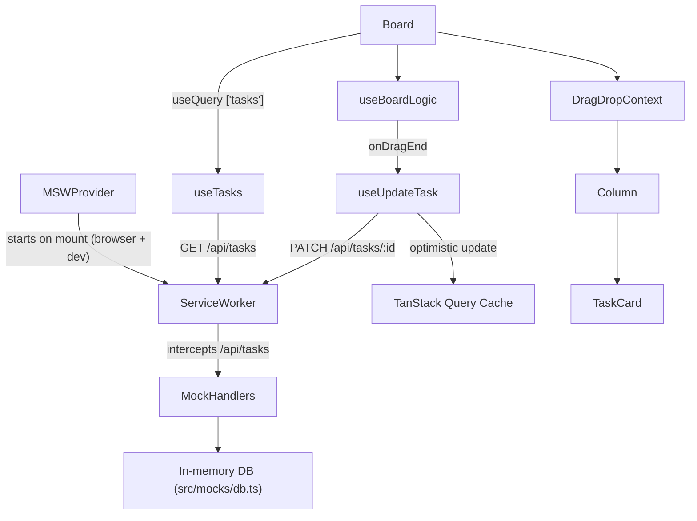

# syncro-task

> An offline-first Kanban board engineered for low latency and data integrity — optimistic UI updates, runtime schema validation, and a fully mocked API layer.


---

## Overview

Standard project management tools fail under poor network conditions. syncro-task addresses this by treating every user interaction as immediately successful — state is updated in the UI first, the network request follows, and any failure rolls back cleanly.

**Core engineering priorities:**

- **INP (Interaction to Next Paint)** — drag-and-drop updates reflect instantly in the UI via optimistic cache mutation, keeping frame budget unaffected by network latency.
- **Data integrity** — all data from the network is validated against a Zod schema at the boundary before it enters React state.
- **Offline-first architecture** — the API layer is fully abstracted behind MSW today, with Dexie Cloud wired in as the next persistence layer.

---

## Tech Stack

| Layer | Library | Version | Purpose |
|---|---|---|---|
| Framework | Next.js (App Router) | 16.1.6 | Routing, SSR, client components |
| UI | React | 19.2.3 | Component model |
| Server state | TanStack Query | ^5.90 | Fetching, caching, mutations |
| Drag and drop | @hello-pangea/dnd | ^18.0.1 | Accessible DnD primitives |
| Validation | Zod | ^4.3.6 | Runtime schema parsing |
| API mocking | MSW | ^2.12.10 | Service Worker–level request interception |
| Styling | Tailwind CSS | ^4 | Utility-first CSS (CSS-first config) |
| Linting | Biome + ultracite | 2.4.0 / 7.2.3 | Format + lint in a single pass |
| Testing | Vitest + Testing Library | ^4 / ^16 | Unit and component tests |
| State (planned) | Zustand | ^5.0.11 | Client-only UI state |
| Animations (planned) | Motion | ^12.34.3 | Layout and gesture animations |
| Virtualization (planned) | TanStack Virtual | ^3.13.19 | Large task lists |
| Offline sync (planned) | Dexie Cloud | — | IndexedDB + cloud sync |

---

## Architecture



### Component responsibilities

The board is split into three layers, each with a single concern:

| Component | Role |
|---|---|
| `Board` | Data container — owns fetching, loading/error states, and `DragDropContext` |
| `Column` | Layout + drop target — owns `Droppable` and passes visual state (pending/error) to cards |
| `TaskCard` | Pure display — owns `Draggable`, renders task data, reflects mutation state via background colour |

Logic that doesn't belong to a render layer lives in `useBoardLogic`: it groups tasks by status and produces the memoized `onDragEnd` callback.

---

## Project Structure

```
src/
├── app/
│   ├── MSWProvider.tsx       # Boots the MSW service worker before first render
│   ├── layout.tsx            # Root layout: fonts, MSWProvider, React Query provider
│   ├── page.tsx              # Entry point: ErrorBoundary → Board
│   └── providers.tsx         # QueryClientProvider
├── features/
│   └── board/
│       ├── api/
│       │   ├── useTasks.ts         # GET /api/tasks + Zod validation
│       │   ├── useUpdateTask.ts    # PATCH with full optimistic update lifecycle
│       │   └── useAddTask.ts       # Stub — not yet implemented
│       ├── components/
│       │   ├── Board.tsx           # DragDropContext, column layout
│       │   ├── BoardSkeleton.tsx   # Loading state
│       │   ├── Column.tsx          # Droppable column
│       │   ├── TaskCard.tsx        # Draggable card
│       │   └── Error.tsx           # ErrorBoundary fallback UI
│       ├── hooks/
│       │   └── useBoardLogic.ts    # taskByStatus grouping + onDragEnd
│       ├── types/
│       │   ├── task.ts             # Zod schemas + inferred Task type
│       │   └── column.ts           # Column interface
│       └── utils/
│           ├── reorder.ts          # Pure array reorder (no mutation)
│           └── reorder.test.ts     # Unit tests
├── lib/
│   └── api-client.ts         # Stub — centralised fetch wrapper (planned)
└── mocks/
    ├── browser.ts            # MSW setupWorker
    ├── db.ts                 # In-memory task store
    └── handlers.ts           # GET, POST, PATCH /api/tasks handlers
```

---

## Key Design Decisions

### MSW as the full API layer

There are no Next.js Route Handlers in this project. Every `/api/tasks` request is intercepted at the Service Worker level by MSW before it leaves the browser. This means the full request/response cycle — including network delays, error simulation, and response shaping — can be developed and tested without a running backend.

The worker is started inside `MSWProvider.tsx`, which dynamically imports `src/mocks/browser.ts` on mount and blocks the render tree until `worker.start()` resolves. `reactStrictMode` is disabled in `next.config.ts` to prevent double-invocation of the effect (which would attempt to register the worker twice in dev).

### Optimistic update pattern

`useUpdateTask` follows the canonical TanStack Query optimistic update flow — no external library required:

```
onMutate  → cancel in-flight queries
          → snapshot current cache
          → reorder cache optimistically (reorder utility)
          → return snapshot as rollback context

onError   → restore snapshot from context

onSettled → invalidate ['tasks'] to sync with server truth
```

The UI reflects the drag result on pointer-up. If the PATCH fails, the board silently restores its previous state and the card turns red to signal the error.

### Zod validation at the network boundary

`useTasks` runs `TaskSchema.array().safeParseAsync()` on the raw JSON before returning data to React Query. Any response that doesn't conform to the schema throws an error that surfaces through the `ErrorBoundary`, rather than letting malformed data propagate silently through the component tree.

The `Task` type is derived directly from the schema (`z.infer<typeof TaskSchema>`), so the type system and the runtime validator are always in sync.

---

## Getting Started

**Prerequisites:** Node.js ≥ 20, pnpm ≥ 9

```bash
# Install dependencies
pnpm install

# Start the dev server (MSW boots automatically)
pnpm dev
```

Open [http://localhost:3000](http://localhost:3000). There is no backend to run — MSW intercepts all API traffic in the browser.

```bash
# Run unit tests
pnpm test

# Watch mode
pnpm test:watch

# Coverage report
pnpm test:coverage

# Lint + format check
pnpm check

# Auto-fix lint and formatting
pnpm fix

# Production build
pnpm build
```

---

## Testing

| Scope | Status | Location |
|---|---|---|
| `reorder` utility | Passing (3 cases) | `src/features/board/utils/reorder.test.ts` |
| `useTasks` hook | Stub | `src/features/board/api/useTasks.test.ts` |
| `useUpdateTask` hook | Stub | `src/features/board/api/useUpdateTask.test.ts` |
| `Board` component | Stub | `src/features/board/components/Board.test.tsx` |
| `Column` component | Stub | `src/features/board/components/Column.test.tsx` |
| `TaskCard` component | Stub | `src/features/board/components/TaskCard.test.tsx` |

Planned test additions (in priority order):

1. **`useUpdateTask`** — integration test using MSW's `server` setup to assert optimistic cache mutation and rollback on a mocked 500 response.
2. **`Board` / `Column`** — render tests asserting column grouping, drag context presence, and skeleton/error states.
3. **`useBoardLogic`** — unit test for `onDragEnd` edge cases (no destination, same-position drop, cross-column move).

---

## Roadmap

| Feature | Status | Notes |
|---|---|---|
| Drag-and-drop reordering | Done | Cross-column and within-column |
| Optimistic updates + rollback | Done | Full TanStack Query lifecycle |
| Zod schema validation | Done | `useTasks` network boundary |
| Loading skeleton | Done | `BoardSkeleton` component |
| Add task (`useAddTask`) | Planned | MSW POST handler exists; hook is a stub |
| Centralised API client | Planned | `src/lib/api-client.ts` stub |
| Dexie Cloud offline sync | Planned | Config present; not yet wired to React Query |
| Zustand UI state | Planned | Selected task, modal open state |
| Motion animations | Planned | Card enter/exit, column drop feedback |
| Virtualised task list | Planned | TanStack Virtual for long columns |
| E2E tests (Playwright) | Planned | `e2e/board-flow.spec.ts` exists as empty spec |
